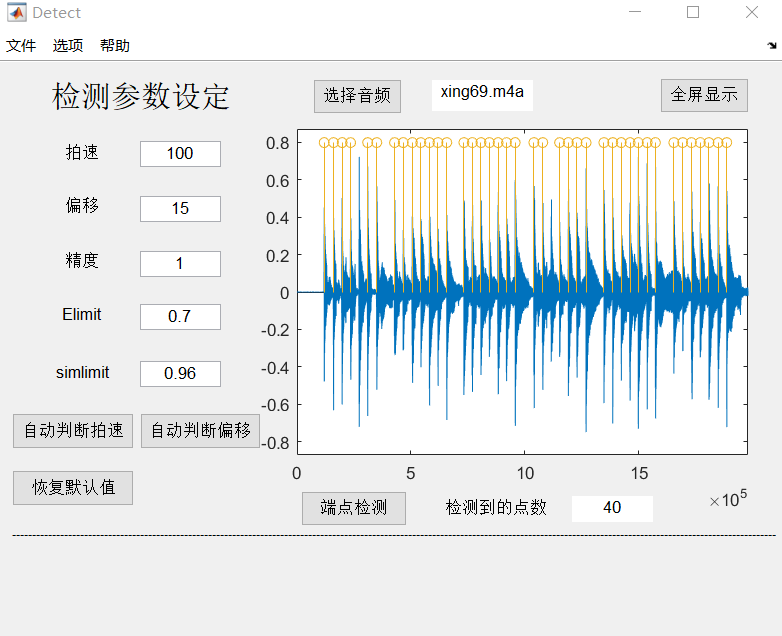

# Endpoint Detection Interface
 A piano music endpoint detection algorithm interface

Usage:
1. Run Detect.m
2. Set parameters. It's fine to use default ones.
3. Press '选择音频' to choose any piano music. You can choose any in 'piano-music' folder.
4. Press '端点检测' to detect the note start points.

Then the detected points will be shown on the interface.

